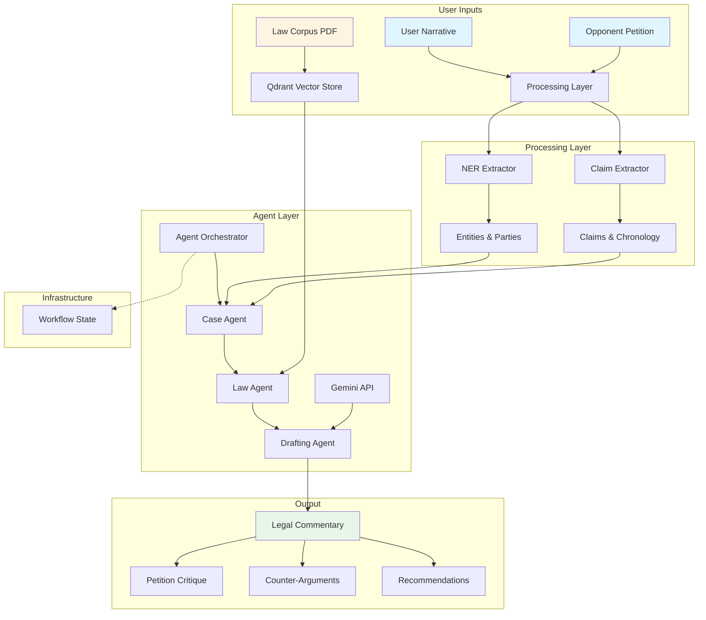
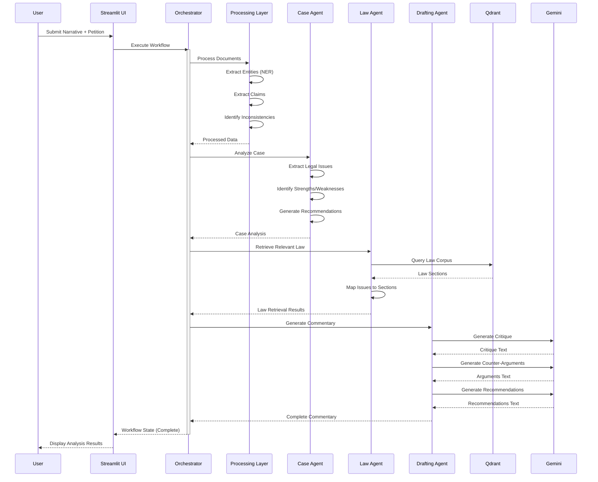

# RAGBot-v2 Architecture Documentation

## Overview

RAGBot-v2 is a multi-agent legal assistant designed to analyze legal disputes in the context of the KPK Local Government Act 2013. It transforms a simple Q&A system (v1) into a sophisticated legal analysis platform capable of processing user narratives and opponent petitions to generate comprehensive legal commentary.

## System Architecture (Option 3: Multi-Agent Legal Assistant)

### High-Level Architecture



### Workflow Sequence



## Component Details

### 1. Processing Layer (`processing.py`)

**Purpose**: Extract structured information from unstructured legal text.

**Components**:
- **NERExtractor**: Named Entity Recognition using spaCy
  - Extracts: Persons, Organizations, Dates, Locations, Legal Terms, Statutory References
  - Legal-specific pattern matching for terms not detected by generic NER
- **ClaimExtractor**: Extracts legal claims and temporal information
  - Claim types: allegations, demands, violations, relief, facts
  - Chronology extraction: dates and associated events
  - Inconsistency detection: compares narrative vs petition
- **DocumentProcessor**: Combines NER and Claim extraction

**Key Methods**:
```python
processor.process_case(narrative, petition) -> Dict[str, Any]
```

**Output Structure**:
```json
{
  "narrative": {
    "entities": {...},
    "parties": {...},
    "claims": [...],
    "chronology": [...],
    "demands": [...]
  },
  "petition": {...},
  "inconsistencies": [...],
  "analysis": {...}
}
```

### 2. Case Agent (`case_agent.py`)

**Purpose**: Analyze case to extract legal issues and strategic insights.

**Key Functions**:
- Extract legal issues from processed claims
- Categorize issues (jurisdictional, procedural, substantive, etc.)
- Identify strengths and weaknesses
- Generate tactical recommendations
- Assess case complexity

**Input**: Processed data from Processing Layer
**Output**: Case Analysis with issues, strengths, weaknesses, recommendations

**Issue Categories**:
- Jurisdictional
- Procedural
- Substantive
- Constitutional
- Administrative
- Financial
- Electoral

### 3. Law Agent (`law_agent.py`)

**Purpose**: Retrieve relevant statutory provisions from law corpus.

**Key Functions**:
- Build optimized queries from legal issues
- Query Qdrant vector store (hybrid search)
- Map issues to relevant law sections
- Rank sections by aggregate relevance
- Provide fallback retrieval (BM25-only) if needed

**Integration with Existing RAG**:
- Leverages `EnhancedQdrantVectorStore` from v1
- Uses smart_search for best retrieval strategy
- Supports pinpoint citation with sliced_text

**Input**: Legal issues from Case Agent
**Output**: Issue-to-law mapping with ranked sections

### 4. Drafting Agent (`drafting_agent.py`)

**Purpose**: Generate formal legal commentary and analysis.

**Key Functions**:
- Generate petition critique (strengths/weaknesses)
- Draft counter-arguments with statutory backing
- Provide strategic recommendations
- Generate procedural guidance
- Export to Markdown format

**Gemini Prompts**:
- **Petition Critique**: Analyze opponent's petition for defects
- **Counter-Arguments**: Draft responses with statutory references
- **Recommendations**: Strategic and tactical guidance
- **Formal Response**: Draft structure for legal filing

**Input**: Case Analysis + Law Retrieval
**Output**: Structured legal commentary

### 5. Orchestrator (`orchestrator.py`)

**Purpose**: Coordinate multi-agent workflow execution.

**Components**:
- **AgentOrchestrator**: Executes workflow steps
- **WorkflowState**: Maintains state for audit trail

**Workflow Steps**:
1. **Processing**: NER + Claim Extraction
2. **Case Analysis**: Issue extraction
3. **Law Retrieval**: Query law corpus
4. **Drafting**: Generate commentary

**Features**:
- Sequential execution with state persistence
- Error handling and fallback mechanisms
- Resumable workflows (save/load state)
- Execution logging for audit

### 6. UI Layer (`app_v2.py`)

**Purpose**: Streamlit interface for both v1 and v2 modes.

**Modes**:
- **v1 Q&A Mode**: Simple law Q&A (backward compatible)
- **v2 Multi-Agent Mode**: Full narrative + petition analysis

**v2 UI Features**:
- Dual input (Narrative + Petition)
- Tabbed output display:
  - Executive Summary
  - Entities & Claims
  - Legal Issues
  - Relevant Laws
  - Legal Commentary
- Markdown export for reports
- Real-time workflow status

## Data Flow

### Input → Processing → Agents → Output

```
User Narrative + Opponent Petition
    ↓
[Processing Layer]
    → Entities, Claims, Chronology
    ↓
[Case Agent]
    → Legal Issues, Strengths, Weaknesses
    ↓
[Law Agent] + [Qdrant Vector Store]
    → Relevant Law Sections (with citations)
    ↓
[Drafting Agent] + [Gemini API]
    → Petition Critique
    → Counter-Arguments
    → Recommendations
    → Procedural Guidance
    ↓
User-Facing Legal Commentary Report
```

## Governance and Trust Mechanisms

### 1. Citation Enforcement
- All law sections come from Qdrant retrieval (no hallucination)
- Max citations per answer (default: 4) to prevent stuffing
- Pinpoint citations with subsection labels when available
- Raw law text always displayed for audit

### 2. Precision Filtering
- Keyword overlap thresholds for focused retrieval
- Cross-encoder re-ranking for tight matches
- De-duplication by section/schedule
- Gap awareness: states absence of explicit mechanisms

### 3. Disclaimers
- Every commentary includes legal disclaimer
- Warns about AI-generated nature
- Recommends consultation with licensed attorney
- Limitations explicitly stated

### 4. Audit Trail
- Workflow state persisted with all intermediate outputs
- Execution log captures each step
- Errors and warnings tracked separately
- Session IDs for reproducibility

## Environment Configuration

### Required Environment Variables

```bash
# Gemini API (for commentary generation)
GEMINI_API_KEY=<your_key>

# Qdrant Cloud (for law corpus retrieval)
QDRANT_URL=<your_cluster_url>
QDRANT_API_KEY=<your_key>
QDRANT_COLLECTION_NAME=kpk_local_govt_act_2013

# Embedding Configuration
EMBEDDING_MODEL_NAME=sentence-transformers/all-mpnet-base-v2
RAGBOT_MAX_CITATIONS=4

# NLP Configuration
SPACY_MODEL=en_core_web_sm
```

### Where to Obtain Keys

1. **Gemini API Key**: [Google AI Studio](https://makersuite.google.com/app/apikey)
2. **Qdrant Cloud**: [Qdrant Cloud Console](https://cloud.qdrant.io/)
3. **spaCy Model**: `python -m spacy download en_core_web_sm`

## Testing Strategy

### Unit Tests
- `test_processing.py`: NER and claim extraction
- `test_orchestrator.py`: Workflow state and orchestration
- Mock dependencies (Qdrant, Gemini) for isolated testing

### Integration Tests
- End-to-end workflow with sample narrative + petition
- Verify output structure and completeness
- Check error handling and fallback mechanisms

### Running Tests
```bash
pytest tests/ -v
```

## Deployment Considerations

### Performance
- **Embedding Batch Size**: Configurable via `RAGBOT_EMBED_BATCH`
- **Device Selection**: Auto-detects CUDA/MPS, falls back to CPU
- **Caching**: Qdrant handles vector caching

### Scalability
- Stateless agents enable horizontal scaling
- Workflow state can be externalized to database
- Vector store already cloud-hosted (Qdrant)

### Security
- API keys in environment variables (never hardcoded)
- Input validation on narrative/petition text
- Output sanitization for markdown export

## Future Enhancements

1. **Multi-Language Support**: Extend NER for Urdu legal documents
2. **Document Upload**: Support PDF/DOCX petition uploads
3. **Comparative Analysis**: Compare multiple petitions
4. **Precedent Retrieval**: Query case law database
5. **Workflow Branching**: Handle alternative dispute resolution paths

---

**Version**: 2.0
**Last Updated**: 2025-10-01
**Maintained By**: RAGBot Development Team
